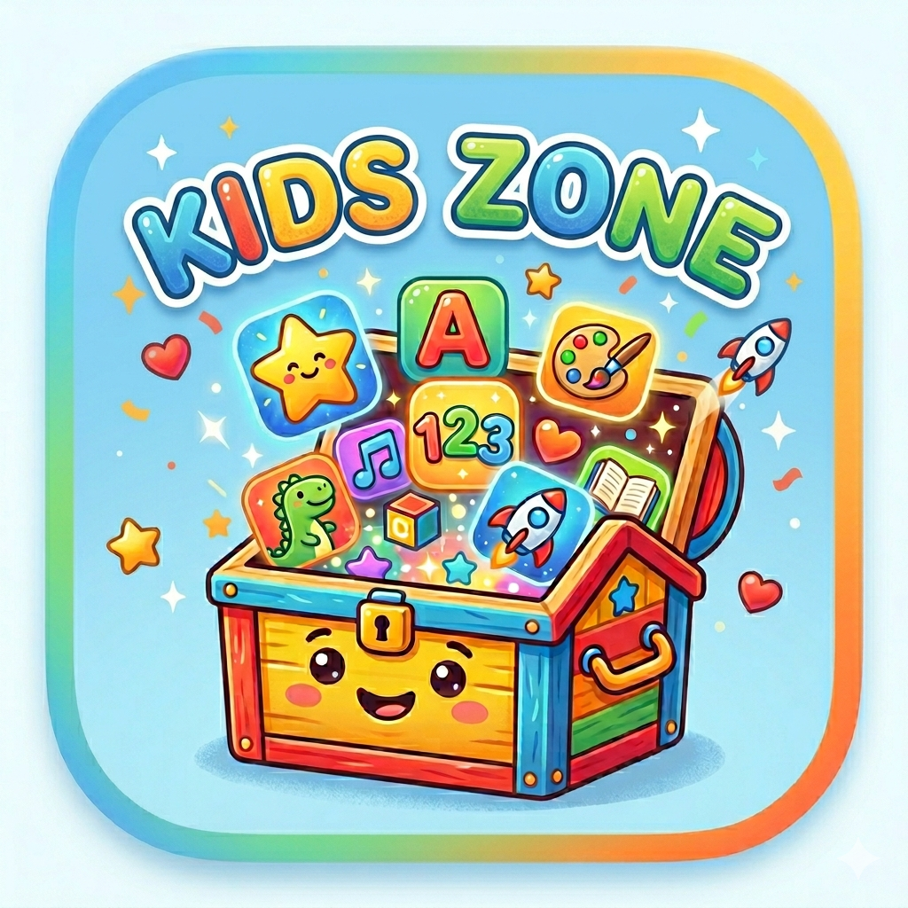
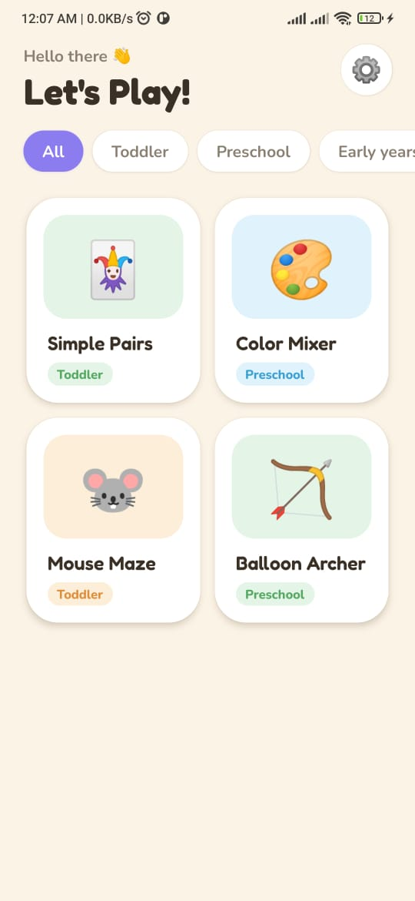
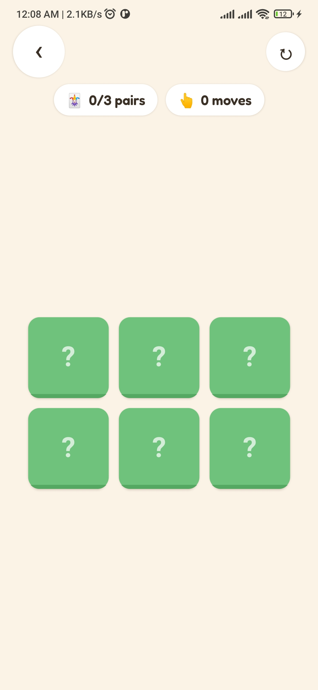
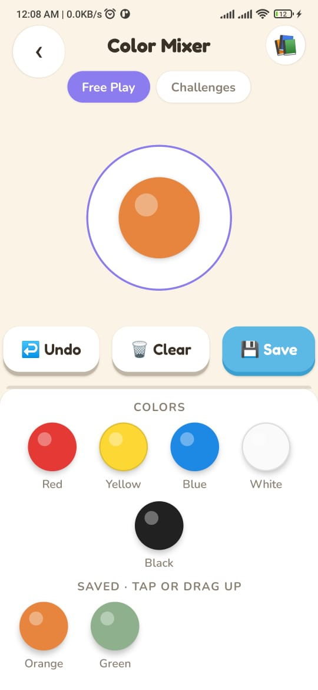
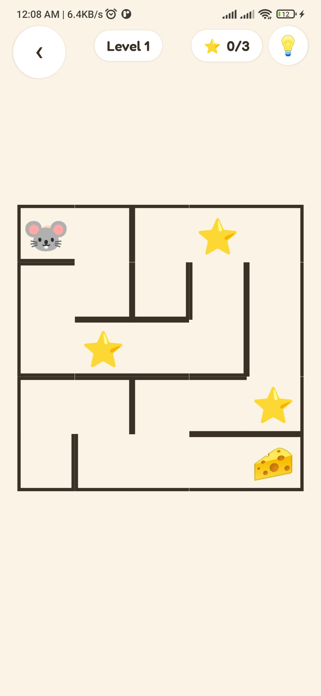
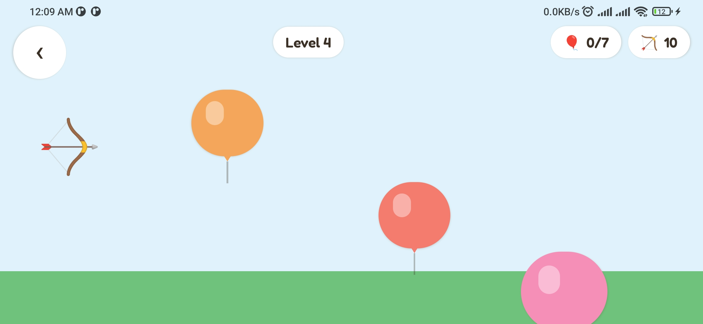

<p align="center">
  
</p>

# Kids Games

A multi-game Expo React Native app for young children (ages 2–10). Each game is a self-contained module that plugs into a shared **SDK** providing navigation, a kid-friendly design system, sound, storage, levels/progress, settings, and age bands.

## Screenshots

<p align="center">
  
  
  
  
</p>
<p align="center">
  
</p>

## Getting Started

```bash
npm install   # if peer-dep conflicts appear, use: npm install --legacy-peer-deps
npx expo start
```

Then open in Expo Go on your device, or press `a` for Android emulator / `i` for iOS simulator.

For full setup, testing on a phone via Expo Go, and local/EAS cloud builds across platforms, see **[docs/SETUP.md](docs/SETUP.md)**.

## Tech Stack

- Expo SDK 54, React 19, React Native 0.81
- TypeScript (strict mode)
- React Navigation (native-stack)
- `react-native-safe-area-context`, `react-native-gesture-handler`, `expo-av`, `expo-haptics`
- Fonts: Fredoka (display) + Nunito (body) via `@expo-google-fonts/*`

## Architecture

```
App.tsx                     # Entry: loads fonts, SafeAreaProvider, NavigationContainer, game registration
src/
├── app/navigation/         # RootNavigator — screens: Home, GamePlayer, Settings
├── screens/                # HomeScreen (game grid), GamePlayerScreen (loads game by id), SettingsScreen
├── sdk/                    # SDK platform core — the single import surface for games (@/sdk)
│   ├── config/             # registerGame / getGame / getAllGames + GameConfig types
│   ├── layout/             # GameShell, useGameShell, useScreenBack
│   ├── audio/              # useSound (play SFX by intent)
│   ├── storage/            # createStore (AsyncStorage-backed)
│   ├── progress/           # levels & resume: useLevels, ResumePrompt
│   ├── settings/           # useSettings (sound / haptics / age band)
│   ├── age/                # AGE_BANDS, gamesForBand, bandsForGame
│   └── assets/             # shared 8-bit SFX manifest
├── components/common/      # Design-system primitives (see below)
├── constants/              # Design tokens: COLORS, ACCENTS, SPACING, BORDER_RADIUS, FONT_SIZES, FONTS, SHADOWS, TOUCH_TARGET
├── games/
│   ├── index.ts            # Side-effect imports that register each game
│   ├── _template/          # Copy this to start a new game
│   ├── simple-pairs/       # Memory matching card game
│   ├── color-mixer/        # Color mixing & discovery game
│   ├── mouse-maze/         # Swipe-to-solve maze with levels
│   └── balloon-archer/     # Aim-and-pop balloon arcade game
├── types/                  # RootStackParamList, shared types
├── hooks/                  # Shared hooks
└── utils/                  # Shared helpers
```

**Flow:** `App.tsx` imports `src/games/index.ts` (triggers all game registrations via each game's `config.ts`) → `HomeScreen` calls `getAllGames()`/`gamesForBand()` to render the grid → tapping a card navigates to `GamePlayerScreen`, which loads the game component by id.

## The SDK (`@/sdk`)

Games import **only** from `@/sdk` — never from another game or deep `src/` paths. The SDK is the stable public surface:

- **Config & registry** — `registerGame`, `getGame`, `getAllGames`, `GameConfig`
- **Layout** — `GameShell` + `useGameShell` (shell mode); `useScreenBack` (intercept back to step up internal screens before exiting)
- **Audio** — `useSound().play('pop' | 'success' | 'win' | 'wrong' | …)`
- **Storage** — `createStore(namespace, defaultValue)`
- **Progress & levels** — `useLevels`, `levelsFromList`/`levelsFromGenerator`, `ResumePrompt`
- **Settings / Age** — `useSettings`, `AGE_BANDS`, `gamesForBand`
- **Assets** — `ASSETS`, `findAssets`, `pickAsset`

## Design system

One warm cream design system (ported from `design/`): cream canvas, warm-brown ink, friendly violet brand, and per-game **accent** families. Use tokens + primitives — no raw hex, system fonts, or hand-rolled controls.

- **Tokens** (`@/sdk`): `COLORS`, `ACCENTS` (`green`/`orange`/`coral`/`purple`/`blue`/`pink`), `FONTS` (`display`=Fredoka, `body*`=Nunito), `SHADOWS`, `SPACING`, `BORDER_RADIUS`, `FONT_SIZES`, `TOUCH_TARGET`
- **Primitives** (`components/common`, re-exported from `@/sdk`): `PressableButton` (chunky CTA), `BigButton`, `IconButton`, `AppBar`, `Chip`, `HudPill`, `EmojiFrame`, `Star`, `GameCard`, `BackButton`, `SafeContainer`

See `CLAUDE.md` (Design-system adherence) and the `kids-games-dev` skill for the full contract.

## Games

| Game | Ages | Theme | Description |
|------|------|-------|-------------|
| **Simple Pairs** | 2–5 | Memory | Match pairs of cards across Easy→Expert levels |
| **Color Mixer** | 4–8 | Color theory | Blend RGB colors to discover famous colors, solve closeness challenges, and save your own |
| **Mouse Maze** | 3–8 | Logic | Swipe to guide the mouse to the cheese, collecting stars; levels resume on return |
| **Balloon Archer** | 5–8 | Aim & arcade | Aim your bow and pop the balloons across levels, with limited arrows |

## Adding a New Game

See [src/games/HOW_TO_ADD_GAME.md](src/games/HOW_TO_ADD_GAME.md) and the `kids-games-dev` skill for the full guide.

**TL;DR:**

1. Copy `src/games/_template` to `src/games/your-game`
2. Update `config.ts` (metadata + `accent`) and call `registerGame()` from `@/sdk`
3. Build your game in `index.tsx`, importing only from `@/sdk`
4. Add a side-effect import in `src/games/index.ts`

The game automatically appears on the home screen.

## Quality checks

```bash
npx tsc --noEmit                 # type check (strict)
CI=1 npx jest --watchAll=false   # unit tests (pure logic)
npx expo export --platform ios   # validate the bundle resolves
```
