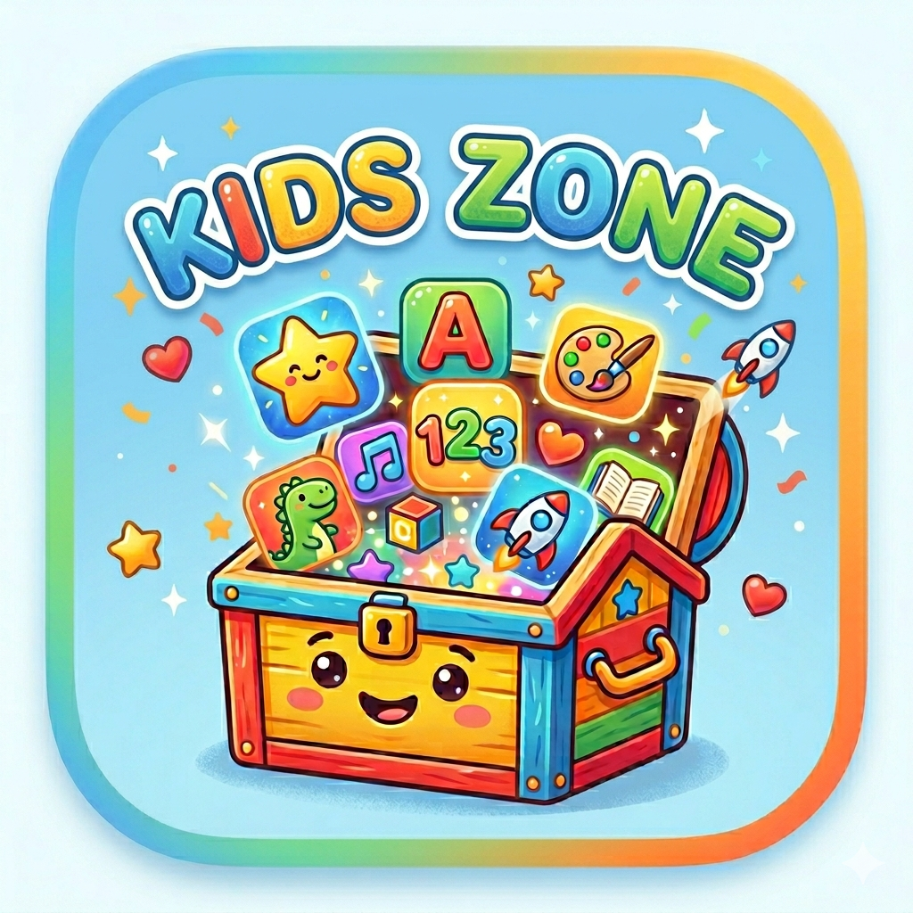
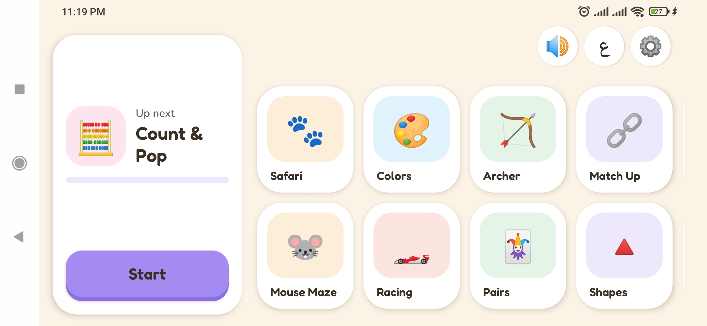
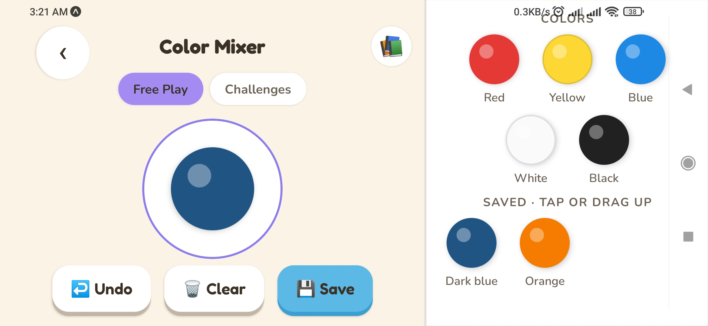
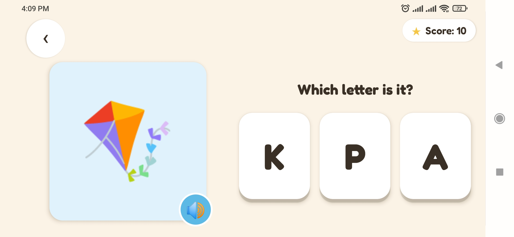
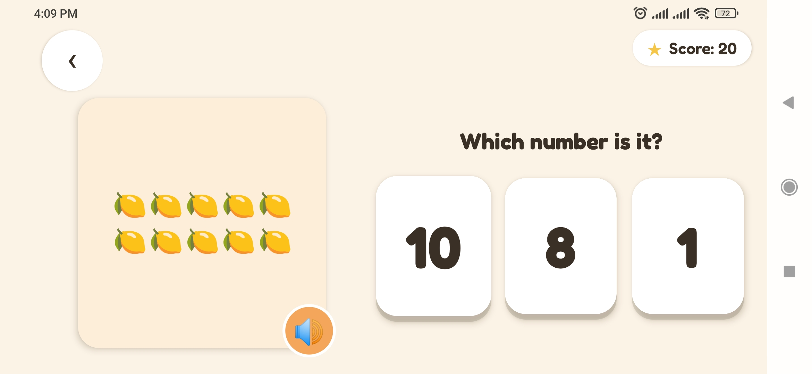
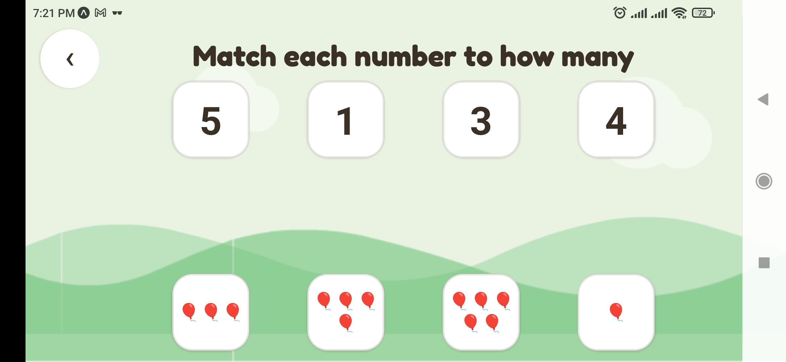
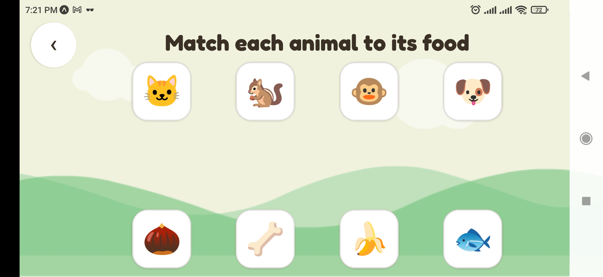

<p align="center">
  
</p>

# Kids Games

A multi-game Expo React Native app for young children (ages 2–12). Each game is a self-contained module that plugs into a shared **SDK** providing navigation, a kid-friendly design system, sound, storage, levels/progress, settings, English + Arabic (full RTL), and age bands. The app runs **landscape-only**.

## Screenshots

<p align="center">
  
</p>
<p align="center">
  
</p>
<p align="center">
  
  
</p>
<p align="center">
  
  
</p>

## Get it

The app ships on Google Play as **Kids Zone: Fun Learning Games**.

<p align="center">
  <a href="https://play.google.com/store/apps/details?id=dev.waybeyond.kidszone">
    
  </a>
</p>

Prefer to sideload? The **[Releases page](https://github.com/YasienDwieb/kids-games/releases/latest)**
carries a signed APK — copy it to an Android device and install it (you may need to allow
"install from unknown sources"). Note that the APK there lags the store build; **Google Play
is the current version**.

## Store listing (Google Play)

The Google Play store listing — title, descriptions, release notes, and graphics
(English + Arabic) — is managed as code with [`fastlane supply`](https://docs.fastlane.tools/actions/supply/)
under [`fastlane/`](fastlane/). See **[docs/PLAY_STORE.md](docs/PLAY_STORE.md)** for the
layout, character limits, and the `tracks` / `validate` / `metadata` / `changelog` / `promote` /
`rollout` / `pull` lanes. Builds come from EAS via
[`.github/workflows/release-aab.yml`](.github/workflows/release-aab.yml), which submits to
production as a **draft** — `fastlane rollout version_code:<vc>` is the step that makes a
release live.

## Getting Started

```bash
npm install   # if peer-dep conflicts appear, use: npm install --legacy-peer-deps
npx expo start
```

Then open in Expo Go on your device, or press `a` for Android emulator / `i` for iOS simulator / `w` for web (or `npm run web`). The app runs on **Android, iOS, and the web** (React Native Web).

For full setup, testing on a phone via Expo Go, and local/EAS cloud builds across platforms, see **[docs/SETUP.md](docs/SETUP.md)**.

## Tech Stack

- Expo SDK 57, React 19.2, React Native 0.86 (New Architecture)
- TypeScript (strict mode)
- React Navigation (native-stack)
- `react-native-safe-area-context`, `react-native-gesture-handler`, `expo-audio`, `expo-haptics`, `expo-speech`, `expo-screen-orientation`
- `react-native-reanimated` + `react-native-worklets` — UI-thread game motion (needs a native/EAS build, not OTA)
- i18n: `i18next` + `react-i18next` + `expo-localization` — English + Arabic with full RTL
- Fonts: Fredoka (display) + Nunito (body), IBM Plex Sans Arabic (RTL) via `@expo-google-fonts/*`

## Architecture

```
App.tsx                     # Entry: loads fonts, SafeAreaProvider, NavigationContainer, game registration
src/
├── app/navigation/         # RootNavigator — screens: Home, GamePlayer, Settings
├── screens/                # HomeScreen (game grid), GamePlayerScreen (loads game by id), SettingsScreen (behind ParentGate)
├── sdk/                    # SDK platform core — the single import surface for games (@/sdk)
│   ├── config/             # registerGame / getGame / getAllGames + GameConfig types
│   ├── layout/             # GameShell, useGameShell, useScreenBack
│   ├── audio/              # useSound (play SFX by intent, per-game win jingles)
│   ├── storage/            # createStore (AsyncStorage-backed)
│   ├── progress/           # levels & resume: useLevels, ResumePrompt
│   ├── settings/           # useSettings (sound / haptics / age band / language)
│   ├── age/                # AGE_BANDS, gamesForBand, bandsForGame
│   ├── i18n/               # useTranslation, registerTranslations, useLanguage (en + ar, RTL)
│   ├── flow/               # Guided Journey: sequencing, progress, scene backdrop
│   ├── motion/             # useGameLoop / useTilt (reanimated UI-thread motion)
│   ├── speech/             # useSpeech (spoken prompts for listen-and-find games)
│   └── assets/             # shared soft CC0 SFX manifest (Kenney; see CREDITS.md)
├── components/common/      # Design-system primitives (see below)
├── constants/              # Design tokens: COLORS, ACCENTS, SPACING, BORDER_RADIUS, FONT_SIZES, FONTS, SHADOWS, TOUCH_TARGET
├── games/
│   ├── index.ts            # Side-effect imports that register each game
│   ├── _template/          # Copy this to start a new game
│   ├── _shared/            # Cross-game building blocks (listen-find board & round generator)
│   ├── simple-pairs/       # Memory matching card game
│   ├── color-mixer/        # Paint-mixing & color discovery
│   ├── mouse-maze/         # Swipe-to-solve maze with levels
│   ├── balloon-archer/     # Aim-and-pop balloon arcade game
│   ├── shape-detective/    # Shape pattern & logic puzzles
│   ├── turbo-road/         # Steer-and-dodge road-trip racing
│   ├── count-and-pop/      # Count objects and pop the number
│   ├── match-up/           # Draw a line from each thing to its match
│   ├── letter-land/        # Listen-and-find letters (phonics)
│   ├── numbers-land/       # Listen-and-find numbers
│   ├── animal-safari/      # Listen-and-find animals (first words)
│   └── candy-catch/        # Slide-the-basket catching arcade
├── types/                  # RootStackParamList, shared types
├── hooks/                  # Shared hooks
└── utils/                  # Shared helpers
```

**Flow:** `App.tsx` imports `src/games/index.ts` (triggers all game registrations via each game's `config.ts`) → `HomeScreen` calls `getAllGames()`/`gamesForBand()` to render the grid → tapping a card navigates to `GamePlayerScreen`, which loads the game component by id.

## The SDK (`@/sdk`)

Games import **only** from `@/sdk` — never from another game or deep `src/` paths. The SDK is the stable public surface:

- **Config & registry** — `registerGame`, `getGame`, `getAllGames`, `GameConfig`
- **Layout** — `GameShell` + `useGameShell` (shell mode); `useScreenBack` (intercept back to step up internal screens before exiting)
- **Audio** — `useSound().play('sfx.pop' | 'sfx.success' | 'sfx.win' | 'sfx.wrong' | …)`; each intent has several soft variants picked at random, and every game sets its own win jingle via `GameConfig.sounds`
- **Storage** — `createStore(namespace, defaultValue)`
- **Progress & levels** — `useLevels`, `levelsFromList`/`levelsFromGenerator`, `ResumePrompt`
- **Settings / Age** — `useSettings`, `AGE_BANDS`, `gamesForBand`
- **i18n** — `useTranslation().t`, `registerTranslations`, `useLanguage` (English + Arabic, full RTL; per-game locale bundles)
- **Assets** — `ASSETS`, `findAssets`, `pickAsset`

## Design system

One warm cream design system (ported from `design/`): cream canvas, warm-brown ink, friendly violet brand, and per-game **accent** families. Use tokens + primitives — no raw hex, system fonts, or hand-rolled controls.

- **Tokens** (`@/sdk`): `COLORS`, `ACCENTS` (`green`/`orange`/`coral`/`purple`/`blue`/`pink`), `FONTS` (`display`=Fredoka, `body*`=Nunito), `SHADOWS`, `SPACING`, `BORDER_RADIUS`, `FONT_SIZES`, `TOUCH_TARGET`
- **Primitives** (`components/common`, re-exported from `@/sdk`): `PressableButton` (chunky CTA), `BigButton`, `IconButton`, `AppBar`, `Chip`, `HudPill`, `EmojiFrame`, `Star`, `GameCard`, `BackButton`, `SafeContainer`

See `CLAUDE.md` (Design-system adherence) and the `kids-games-dev` skill for the full contract.

## Games

| Game | Ages | Theme | Description |
|------|------|-------|-------------|
| **Simple Pairs** | 2–5 | Memory | Match pairs of cards across Easy→Expert levels |
| **Color Mixer** | 4–8 | Color theory | Mix red, yellow and blue like real paint — tint and shade with white and black, take on color-matching challenges, and save your own |
| **Mouse Maze** | 3–8 | Logic | Swipe to guide the mouse to the cheese, collecting stars; levels resume on return |
| **Balloon Archer** | 5–8 | Aim & arcade | Aim your bow and pop the balloons across levels, with limited arrows |
| **Shape Detective** | 3–10 | Patterns & logic | Spot the next shape, find the odd one out, and sort shapes into groups |
| **Turbo Road** | 4–12 | Racing | Steer, dodge, and collect along sunny roads; win cups and unlock cars in the garage |
| **Count & Pop** | 3–7 | Counting | Count the objects and pop the right number |
| **Match Up** | 3–7 | Matching | Draw a line from each thing to its match (animals→food, helpers→tools, and more) |
| **Letter Land** | 3–7 | Literacy & phonics | Listen and find the letter — with spoken prompts and word-picture heroes |
| **Numbers Land** | 3–7 | Numbers | Listen and find the number, with spoken prompts |
| **Animal Safari** | 3–7 | First words | Listen and find the animal — by name or by the sound it makes |
| **Candy Catch** | 3–7 | Reflex & arcade | Slide the basket to catch the treats and dodge the yucky ones |

## Adding a New Game

See [src/games/HOW_TO_ADD_GAME.md](src/games/HOW_TO_ADD_GAME.md) and the `kids-games-dev` skill for the full guide.

**TL;DR:**

1. Copy `src/games/_template` to `src/games/your-game`
2. Update `config.ts` (metadata + `accent`) and call `registerGame()` from `@/sdk`
3. Build your game in `index.tsx`, importing only from `@/sdk`
4. Add a side-effect import in `src/games/index.ts`

The game automatically appears on the home screen.

## Quality checks

```bash
npx tsc --noEmit                 # type check (strict)
CI=1 npx jest --watchAll=false   # unit tests (pure logic)
npx expo export --platform ios   # validate the bundle resolves
```

## License

The **code** is licensed under the [Apache License 2.0](LICENSE). You're welcome
to build your own games on top of it, fork it, and publish — including for your
own kids. Per the [`NOTICE`](NOTICE) file, derivative works must keep the
attribution ("Based on the Kids Games project").

The **"Kids Games" name, logo, and app icon are reserved** and are *not* covered
by the code license (Apache-2.0 §6). Please use a different name and branding for
your own published builds.

Bundled third-party assets keep their own licenses — see [CREDITS.md](CREDITS.md).
